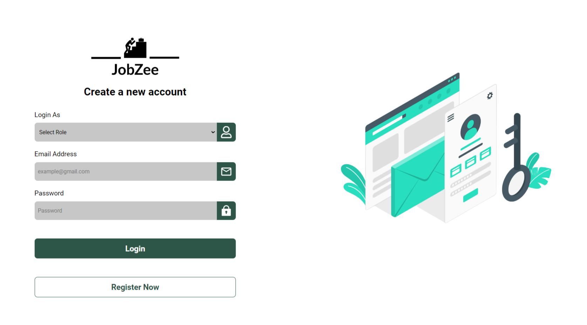

<div align="center">
  <br />
    <a href="job-seeking-app-scrennshot.png" target="_blank">
      
    </a>
  
  <br />

  <!-- <div>
    
    
    
  </div> -->

  <h3 align="center">Jobzee - Job Seeking App</h3>

</div>

## 📋 <a name="table">Table of Contents</a>

1. ⚙️ [Tech Stack](#tech-stack)
2. 🔋 [Features](#features)
3. 🤸 [Quick Start](#quick-start)
4. 🕸️ [Code](#snippets)
5. 🚀 [More](#more)


## <a name="tech-stack">⚙️ Tech Stack</a>

- Reactjs
- react-hot-toast
- Clerk
- react-icons
- react-toastify

## <a name="features">🔋 Features</a>


👉 **User Authentication and Authorization**: The job seeking web application includes user registration with email verification, user login/logout functionality using JWT token authentication, and role-based access control for both job seekers and employers.

👉 **Job Listings**: The application features the ability for employers to post job listings, including details such as title, description, salary range, location, and required qualifications, along with job search functionality for seekers based on filters like location, job type, and salary range. Additionally, users can view detailed job descriptions and apply for jobs within the platform.

👉 **Resume Upload**: Job seekers have the capability to upload their resumes in formats like PDF or PNG, with Cloudinary integration enabling seamless handling of resume uploads and storage.

👉 **Responsive Design**: Follows responsive design principles to ensure optimal user experience across devices, adapting seamlessly to different screen sizes and resolutions.

and many more, including code architecture and reusability. 

## <a name="quick-start">🤸 Quick Start</a>

Follow these steps to set up the project locally on your machine.

**Prerequisites**

Make sure you have the following installed on your machine:

- [Git](https://git-scm.com/)
- [Node.js](https://nodejs.org/en)
- [npm](https://www.npmjs.com/) (Node Package Manager)

**Cloning the Repository**

```bash
git clone https://github.com/shiras-v-m/Job-Seeking-App.git
cd Job-Seeking-App
```

**Installation**

Install the project dependencies using npm:

```bash
npm install
```

**Set Up Environment Variables**

Create a config folder named `config` in the root of your project and create config file inside the folder:

```config
PORT = 4000

CLOUDINARY_CLIENT_NAME= YOUR_CLOUDINARY_CLIENT_NAME
CLOUDINARY_CLIENT_API= YOUR_CLOUDINARY_CLIENT_API
CLOUDINARY_CLIENT_SECRET= YOUR_CLOUDINARY_CLIENT_SECRET

FRONTEND_URL=http://localhost:5173/

MONGO_URL=mongodb://127.0.0.1:27017

JWT_SECRET_KEY= YOUR_JWT_SECRET_KEY 
JWT_EXPIRE=7d
COOKIE_EXPIRE=5

```

Replace the placeholder values with your actual credentials.

**Running the Project**

```bash
npm run dev
```

Open [http://localhost:5173](http://localhost:5173) in your browser to view the project.

